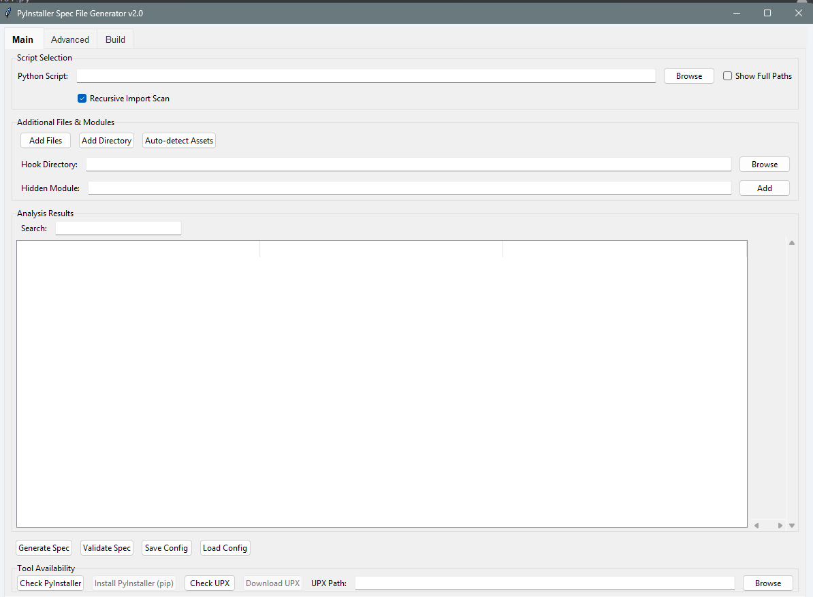
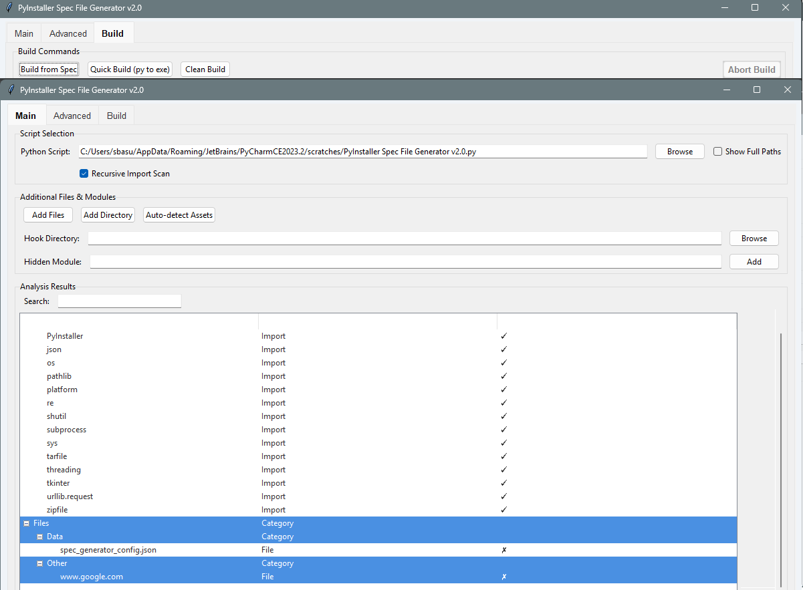
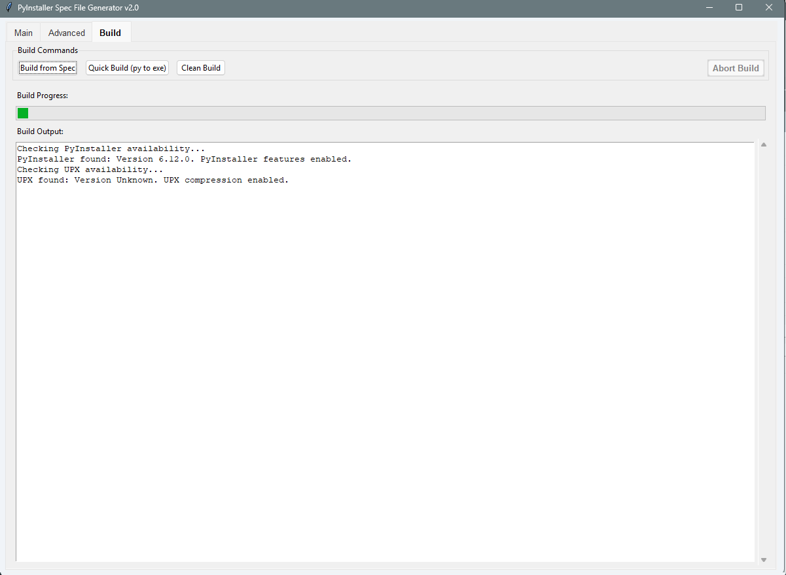
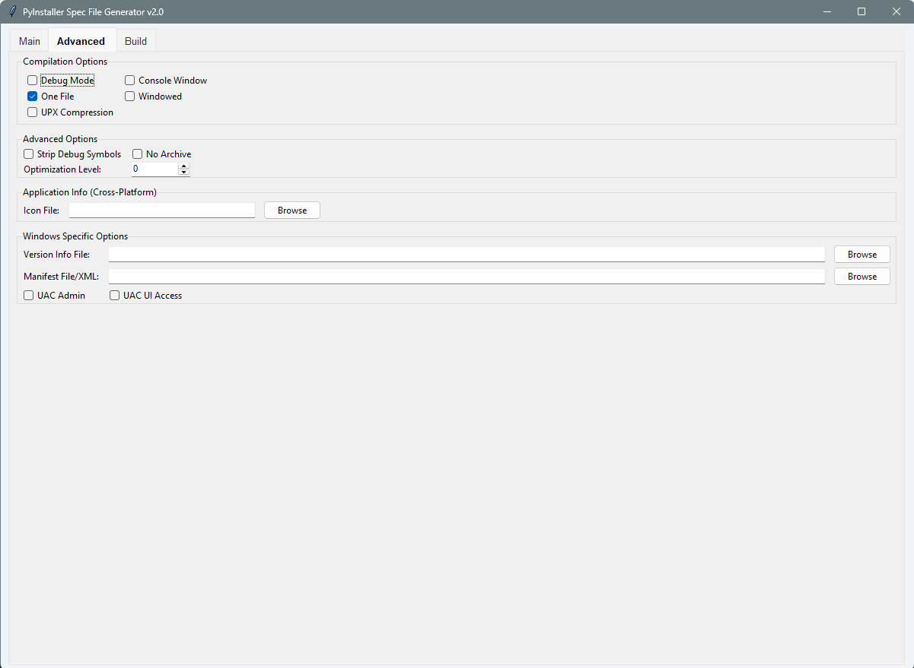

# PyInstaller Spec File Generator v2.0


_Screenshot showing the Main tab with analysis results_

## Overview

The `PyInstaller Spec File Generator` is a graphical user interface (GUI) tool built with Tkinter that simplifies the process of creating `.spec` files for PyInstaller. It also provides functionalities to quickly build executables, analyze Python scripts for dependencies, manage additional files, and even assists with the installation and setup of PyInstaller and UPX.

This tool aims to abstract away the complexities of PyInstaller's command-line arguments and `.spec` file syntax, making it easier for developers to package their Python applications into standalone executables.

## Features

*   **GUI-driven Spec File Generation:** Easily create `.spec` files without memorizing PyInstaller commands.
*   **Script Analysis:** Automatically detect Python imports and potential data files from your main script and its recursive imports.
*   **Dependency Management:**
    *   Manually add additional data files or entire directories.
    *   Specify hidden imports.
    *   Define hook directories.
    *   Auto-detect common asset folders (images, data, etc.).
*   **Build Operations:**
    *   Generate `.spec` files.
    *   Validate existing `.spec` files for missing data files.
    *   Quick build (Python script to executable) with common options.
    *   Build from an existing `.spec` file.
    *   Clean build directories (`build`, `dist`, `__pycache__`).
    *   **Abort Build:** Stop a running PyInstaller process at any time.
*   **Tool Availability Checks:**
    *   Detects if `PyInstaller` is installed for the current Python interpreter.
    *   Detects if `UPX` (Ultimate Packer for eXecutables) is available in your system's PATH.
    *   **One-Click Installation:** Offers to install PyInstaller via `pip` if missing.
    *   **Automated UPX Download/Setup:** Guides you through downloading the correct UPX version for your OS/architecture and extracting it.
*   **Advanced Options:**
    *   Control `onefile`/`onedir` mode, console window, debug mode, UPX compression, strip debug symbols, no archive, and optimization levels.
    *   Set application icon and version info file.
*   **Platform-Specific Configurations:**
    *   **Windows:** Options for UAC admin/UI access, manifest files, and version info.
    *   **macOS:** Options for bundle identifier, codesign identity, entitlements file, and target architecture.
*   **Persistent Configuration:** Save and load your project settings (including paths, options, and lists) to/from a JSON file.
*   **Real-time Output Log:** View PyInstaller's build output directly within the GUI.
*   **Dynamic UI:** Buttons and options are enabled/disabled based on tool availability and build status.
*   **Themed Interface:** Modern Tkinter `ttk` styling with a highlighted selected tab.

## Screenshots

| Main Tab                                      | Build Tab (During Build)                                  |
| :-------------------------------------------- | :-------------------------------------------------------- |
|    |     |
| _Analysis results, additional files, and tool checks._ | _Build output, progress bar, and active 'Abort Build' button._ |

| Advanced Tab (Windows)                           | 
| :----------------------------------------------- | 
|  | 
| _Compilation options and Windows-specific settings._ | _(Conceptual: macOS-specific settings like bundle ID, codesigning)_ |

## Installation

### Prerequisites

*   Python 3.6+
*   Tkinter (usually comes with Python, or install via OS package manager)

### Running the Application

1.  **Clone the repository:**
    ```bash
    git clone https://github.com/your-username/pyinstaller-spec-generator.git
    cd pyinstaller-spec-generator
    ```
    (Or simply download the `pyinstaller_spec_generator.py` file)

2.  **Create a virtual environment (recommended):**
    ```bash
    python -m venv venv
    # On Windows:
    .\venv\Scripts\activate
    # On macOS/Linux:
    source venv/bin/activate
    ```

3.  **Run the application:**
    ```bash
    python pyinstaller_spec_generator.py
    ```
    
### Installing PyInstaller

When you launch the application, it will check for `PyInstaller`. If not found, it will prompt you. You can also manually click the "Check PyInstaller" button.

*   If prompted, click "Yes" to install automatically.
*   Alternatively, you can run `pip install pyinstaller` in your terminal within your active virtual environment.

### Installing UPX (Optional, for smaller executables)

The application also checks for `UPX`. If not found, it will display a "Download UPX" button.

1.  **Click "Download UPX":** The application will download the correct UPX binary for your operating system and architecture (Windows, macOS, Linux, x86_64, arm64).
2.  **Extraction:** UPX will be extracted to a hidden folder in your user's home directory (e.g., `~/.upx_local` or `%USERPROFILE%\.upx_local`).
3.  **PATH Configuration (Important):**
    *   The application will ask if you want to add this folder to your system's `PATH` environment variable. **This step usually requires manual action and administrator privileges.**
    *   **If you choose YES (recommended for global use):** The application will provide instructions on how to manually add `~/.upx_local` (or equivalent Windows path) to your system's PATH. You may need to restart your computer for this change to take full effect.
    *   **If you choose NO (or haven't added to PATH):** The application automatically stores the path to the downloaded UPX executable. You can also explicitly set it using the "Browse" button next to "UPX Path" field in the "Tool Availability" section. The application will then pass this custom path to PyInstaller using the `--upx-dir` argument.

## Usage

1.  **Select Python Script:** On the "Main" tab, click "Browse" to select your main Python script (`.py` file).
2.  **Analyze Script:** The application will automatically analyze your script for imports and files. Review the "Analysis Results" tree.
3.  **Add Files/Modules:**
    *   Use "Add Files" or "Add Directory" to include additional data files or folders not automatically detected.
    *   Use the "Hidden Module" field to add modules that PyInstaller might miss.
    *   "Auto-detect Assets" will scan for common asset folders.
4.  **Configure Options:** Switch to the "Advanced" tab to configure compilation options (one-file/one-dir, console, debug, UPX, etc.) and platform-specific settings.
5.  **Generate Spec File:** Click "Generate Spec" on the "Main" tab to create the `.spec` file in the same directory as your script.
6.  **Build Executable:**
    *   **"Quick Build (py to exe)"**: Builds your executable directly from the selected Python script using the current GUI settings.
    *   **"Build from Spec"**: Allows you to select an existing `.spec` file and build from that.
    *   **"Clean Build"**: Removes `build`, `dist`, and `__pycache__` folders.
7.  **Monitor Progress:** The "Build" tab shows real-time output from PyInstaller.
8.  **Abort Build:** During a build, click the "Abort Build" button (which turns red) to terminate the process.

## Platform-Specific Notes

*   **Windows:**
    *   `--version-file`, `--manifest`, `--uac-admin`, `--uac-uiaccess` options are available.
    *   Icons typically use `.ico` format.
*   **macOS:**
    *   `--osx-bundle-identifier`, `--codesign-identity`, `--osx-entitlements-file`, `--target-architecture` options are available.
    *   Icons typically use `.icns` format.
*   **Linux:**
    *   General options apply.
    *   Icons are often handled differently by desktop environments (e.g., `.png` for `.desktop` files).

## Troubleshooting

*   **"No module named PyInstaller"**: Ensure PyInstaller is installed for the *specific Python interpreter* that is running this GUI application. Use the "Install PyInstaller (pip)" button.
*   **"UPX not found"**: Download UPX using the provided button. Remember to add its directory to your system's PATH environment variable manually for global availability, or ensure the "UPX Path" field is correctly set.
*   **Build Failures**: Check the "Build Output" log carefully for specific error messages from PyInstaller. Common issues include missing data files, hidden imports, or incompatible modules.
*   **Antivirus Warnings**: Compiled executables (especially with UPX) may sometimes trigger antivirus warnings. This is a common false positive for packed executables.

## Contributing

Feel free to open issues for bug reports or feature requests. Pull requests are welcome!

## License

This project is open-source and available under the [MIT License](LICENSE).
